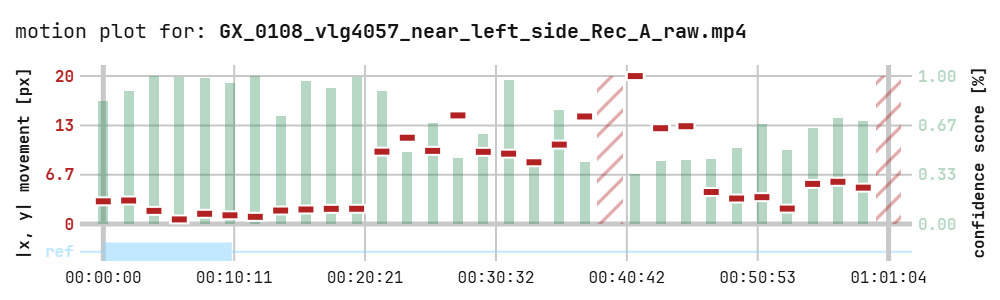

<div align="center">
<h1>calib-move</h1>
</div>

A simple utility package for determining whether a supposedly static camera moved by analyzing a video. Can process multiple videos in one batch and generate plots for each video to quickly overview the results.

## **📦 Contents**
- **Movement analysis (main)**: Processes single videos or batch folders (of videos) to detect camera movement relative to a specified static region. Creates a robust reference image by blending frames from the static window to filter out moving objects. Uses keypoint detection/matching (SIFT, ORB, AKAZE) with geometric filtering to robustly estimating movement between the reference and other frames. Works only when a static background is visible throughout a video.
- **Template JSON generator (helper)**: The static window for multiple videos (of a folder) can be specified by using a json file. To generate a template for such a file, use this function.


## **🏗️ Installation**

### **1. clone the repository**
```
git clone https://github.com/eliassteiner1/balgrist-calib-move.git
cd <repo-folder>
```

### **2.a use locally (without installing)**

go to folder where the repository is cloned:
```
cd <repo-folder>
```

install reqirements:
```
pip install requirements.txt
```

Run the two main scripts of the package locally (no installation with pip necessary):
```
python <repo-folder>/scripts/run.py
python <repo-folder>/scripts/run_generate_template_json.py
```


### **2.b install with pip**

go to folder where the repository is cloned:
```
cd <repo-folder>
```

install with pip:
```
pip install -e .
```
> Note: using `-e` installs in editable mode, so that changes in the source files are immediately updated when running scripts.

this installs two new console commands to the environment
```
calib-move-run
calib-move-generate-template-json
```

## **🕹️ Using the Package**

### **run movement analysis (main)**
use either `calib-move-run` from the command line (when installed) or directly run `python <repo-folder>/scripts/run.py` (when running from source). In both cases, multiple arguments can be given:


- `-h`: prints a help window with info regarding the command arguments

- `--input-path <path>` **(required)**: specify the path to either a single valid video file or a folder containing at least one video file to be processed.

- `--output-path <path>` **(required)**: path to the location where the result plots should be saved.

- `--static-window <string or path>` **(required)**: specify the timestamps for the static window in the video

  - `<string>` : preferred when processing just one video or when the exact same window is applied to multiple videos (in the same folder). There are three different variants to explicitly specify a static window:

    - `START-hh:mm:ss`: represents a static window from the start of a video up to a certain timestamp.

    - `hh:mm:ss-END`: represents a static window starting at some timestamp up to the end of the video.

    - `hh:mm:ss-hh:mm:ss`: represents a static window starting and ending at specific timestamps

  - `<json path>` when loading multiple videos and a different static window should be used for every one, a json file can be used to specify them. the file is a single dict, containing a key (video name) for each video that is specified in `--input-video-path`. The values of the dict are the same timestamp-strings as before. A template of this file can be generated by using the helper function from the next section! for example:
    ```
    {
      "video_1.mp4": "00:02:21-00:05:00",
      "video_2.mp4": "START-00:03:28",
      "video_3.mp4": "01:12:04-END",
      ...
    }
    ```

- `--plot-name`: base name for the output png file (e.g. <plot_name>.png).    

- `--n-init-steps`: number of equally spaced steps (in the static window) for which frames are extracted and combined to form one good reference image without moving elements. The movement is always estimated relative to this static image for all other parts of the video.

- `--init-frame-blending` {MEDIAN,MODE,KDE}: method for combining multiple frames (from the static window) to ideally remove moving elements. 

- `--n-main-steps`: number of equally spaced steps (in the input video) for which the movement is estimated relative to the static frame.

- `--detector` {AKAZE,SIFT,ORB}: cv2 keypoint detector type. 

- `--matcher` {BF_NORM_L2,BF_NORM_HAMM}: cv2 keypoint matching type. (L2 is good for SIFT or SURF, HAMMING is good for binary descriptors e.g. ORB AKAZE or BRISK). 

### **generate template json (helper function)**
use either `calib-move-generate-template-json` from the command line (when installed) or directly run `python <repo-folder>/scripts/run_generate_template_json.py` (when running from source).

- `-h`: prints a help window with info regarding the command arguments

- `--vid-folder-path`: path to the folder containing the videos that will be processed. The output will be a json file with a key for each video name found in the folder and a placeholder timestamp string. The file can then be edited manually. for example:
    ```
    {
      "video_1.mp4": "hh:mm:ss-hh:mm:ss",
      "video_2.mp4": "hh:mm:ss-hh:mm:ss",
      "video_3.mp4": "hh:mm:ss-hh:mm:ss",
      ...
    }
    ```
  
## **✨ Output**
The main movement analysis will save a plot for each processed video in the `--output-path` directory. This plot condenses all the extracted information onto one graph:

<p align="center">
  
</p>

- **Movement**: in red, the estimatad camera movement in pixels is plotted (with respect to the static window). This is (an estimate of) the average absolute value of the motion at each pixel (no directionality). 

- **Confidence Score**: in green, the confidence very roughly measures how likely an estimate is to be true (values below a certain threshold are seen as errors). The score is obtained by comparing the movement estimation of a few different frames close to the respective timestamp and looking at how well these values agree with each other.

- **Errors**: faint red stripes, these blocks are drawn whenever no motion coulb be estimated. The reason can be either a low confidence score or failing to match keypoints (too few keypoints, too few matches).

- **Static Window**: in blue, this bar indicates the section of the video that was specified as the static window and is used to generate the referenc image. All motion is estimated relative to this reference.


## **🎫 License**
This project is licensed under the **MIT License**. See the [LICENSE](https://github.com/eliassteiner1/balgrist-calib-move/blob/main/LICENSE) file for details.


